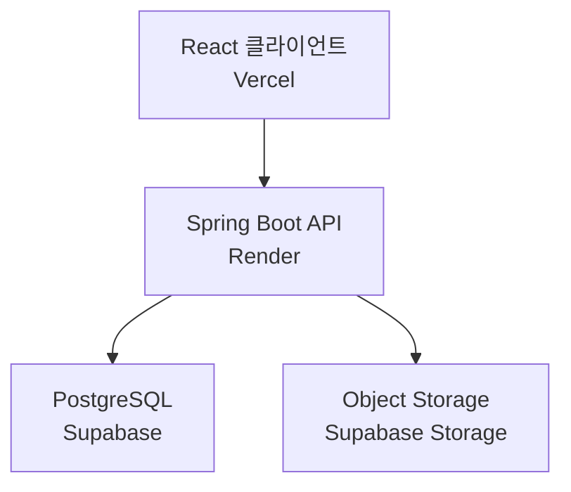

# ImageScope

고해상도 이미지의 해상도와 예상 디코딩 메모리를 분석하고, 원본을 보존하면서 빠르게 조회할 수 있는 미리보기 이미지를 생성하는 서비스입니다.

* [배포 사이트](https://image-scope-six.vercel.app/)
* [GitHub 저장소](https://github.com/Wus01/image-scope)

## 화면

아래 화면을 캡처하여 `docs/images` 폴더에 추가되어있습니다.

* 이미지 업로드 화면
  

* 이미지 분석 및 처리 결과
  

* 저장된 이미지 목록
  

* 원본·미리보기 다운로드 선택 화면
  


## 프로젝트 소개

이미지는 파일 용량이 작더라도 해상도가 지나치게 높으면 브라우저에서 디코딩하고 렌더링할 때 많은 메모리를 사용할 수 있습니다.

ImageScope는 이러한 문제를 확인하기 위해 다음 과정을 구현한 개인 프로젝트입니다.

1. 이미지 전체를 디코딩하기 전에 메타데이터를 읽습니다.
2. 해상도와 픽셀 수를 기준으로 예상 디코딩 메모리를 계산합니다.
3. 원본은 그대로 저장합니다.
4. 목록 조회용 미리보기 이미지를 별도로 생성합니다.
5. 원본과 미리보기의 파일 용량 및 절감률을 제공합니다.

실무에서 경험한 이미지 성능 문제를 일반화하여 독립적으로 설계했으며, 회사 코드나 데이터는 사용하지 않았습니다.

## 주요 기능

* JPG, PNG, GIF 이미지 업로드
* 드래그 앤 드롭 파일 선택
* 이미지 해상도와 메가픽셀 분석
* 예상 디코딩 메모리 계산
* 고해상도 이미지 저메모리 샘플링
* 최대 1280px 미리보기 생성
* 원본과 미리보기 파일 분리 저장
* 원본 대비 미리보기 용량 절감률 제공
* 사용자별 이미지 목록 분리
* 원본 또는 미리보기 다운로드
* 원본과 미리보기 이미지 삭제
* 이미지 처리 상태 및 실패 원인 관리

## 이미지 처리 기준

| 항목          |            기준 |
| ----------- | ------------: |
| 최대 파일 크기    |          20MB |
| 지원 형식       | JPG, PNG, GIF |
| 최대 가로·세로    |      30,000px |
| 최대 픽셀 수     |         300MP |
| 미리보기 최대 크기  | 1280 × 1280px |
| JPEG 출력 품질  |          0.82 |
| 처리 작업 픽셀 기준 |          12MP |

예상 디코딩 메모리는 RGBA 이미지 기준으로 계산합니다.

```text
예상 디코딩 메모리 = 가로 × 세로 × 4byte
```

따라서 압축된 파일 용량과 실제 디코딩 시 필요한 메모리는 서로 다를 수 있습니다.

## 이미지 처리 방식

* 원본 이미지 전체를 먼저 디코딩하지 않고 `ImageReader`로 해상도와 형식을 확인합니다.
* 고해상도 이미지는 `ImageReadParam#setSourceSubsampling`을 적용하여 작업 메모리를 줄입니다.
* Thumbnailator를 이용해 가로·세로 비율을 유지한 미리보기를 생성합니다.
* 투명도가 있는 이미지는 PNG로 저장합니다.
* 일반 이미지는 JPEG로 변환하여 용량을 줄입니다.
* GIF는 첫 번째 프레임을 추출해 미리보기를 생성합니다.
* 미리보기 생성에 실패하더라도 저장된 원본은 유지하고 실패 상태와 원인을 기록합니다.

## 시스템 구성



## 기술 스택

| 구분               | 기술                                    |
| ---------------- | ------------------------------------- |
| Frontend         | React 19, TypeScript, Vite            |
| Backend          | Java 17, Spring Boot, Spring MVC      |
| Database         | PostgreSQL, MyBatis                   |
| Image Processing | Java ImageIO, Thumbnailator           |
| Storage          | Supabase Storage, AWS SDK for Java S3 |
| Deployment       | Vercel, Render                        |
| Build            | npm, Maven, Docker                    |

## 데이터 구조

### `image_job`

원본 이미지의 메타데이터와 처리 상태를 관리합니다.

* 원본 파일명과 형식
* 원본 파일 용량
* 가로·세로 해상도
* 메가픽셀
* 예상 디코딩 메모리
* 처리 상태 및 실패 원인
* 원본 Storage 경로
* 사용자 식별값

### `image_variant`

원본에서 생성된 미리보기 정보를 관리합니다.

* 원본 이미지 ID
* 이미지 유형
* 출력 형식
* 미리보기 용량
* 미리보기 해상도
* Storage 경로

현재 상태와 파생 이미지를 별도 테이블로 관리하여 향후 썸네일 크기나 이미지 형식이 추가될 수 있도록 구성했습니다.

## API

| Method   | Endpoint                         | 설명                   |
| -------- | -------------------------------- | -------------------- |
| `POST`   | `/api/images`                    | 이미지 분석·업로드 및 미리보기 생성 |
| `GET`    | `/api/images`                    | 사용자별 저장 이미지 목록 조회    |
| `GET`    | `/api/images/{imageId}/preview`  | 미리보기 이미지 조회·다운로드     |
| `GET`    | `/api/images/{imageId}/original` | 원본 이미지 다운로드          |
| `DELETE` | `/api/images/{imageId}`          | 원본·미리보기 및 DB 정보 삭제   |

요청에는 사용자 구분을 위한 UUID 형식의 `X-Client-Id` 헤더가 필요합니다.

## 주요 설계 결정

### 파일 용량이 아닌 픽셀 수 분석

압축률이 높은 이미지는 파일 용량이 작아도 해상도가 매우 클 수 있습니다. 따라서 파일 크기만 검사하지 않고 `width × height`를 이용해 픽셀 수와 예상 디코딩 메모리를 계산했습니다.

### 원본과 미리보기 분리

원본은 다운로드 용도로 보존하고, 이미지 목록에서는 최대 1280px로 생성된 미리보기를 사용합니다. 이를 통해 목록 조회 시 네트워크 전송량과 브라우저 렌더링 부담을 줄였습니다.

### 고해상도 이미지 샘플링

고해상도 이미지를 `BufferedImage`로 한 번에 디코딩하면 서버 메모리가 급격하게 증가할 수 있습니다. 이를 방지하기 위해 원본 해상도에 따라 subsampling 비율을 계산하고 축소된 상태로 디코딩합니다.

### DB와 Storage 정합성 처리

Storage 업로드 후 DB 저장에 실패하면 이미 업로드된 객체를 삭제하도록 보상 처리를 적용했습니다. 이미지 삭제 시에는 DB 트랜잭션이 정상적으로 완료된 이후 Storage 객체를 삭제합니다.

### 사용자별 데이터 분리

포트폴리오 MVP에서는 브라우저가 생성한 UUID를 Local Storage에 보관하고 `X-Client-Id` 헤더로 전달합니다. 서버는 해당 값을 기준으로 조회·다운로드·삭제 가능한 이미지를 구분합니다.

이는 실제 인증 기능이 아니며, 운영 서비스에서는 로그인과 Access Token 기반 인증으로 교체해야 합니다.

## 로컬 실행 방법

### Backend

필요 환경:

* Java 17
* PostgreSQL
* Supabase Storage 또는 S3 호환 Storage

다음 환경변수를 설정합니다.

```text
SPRING_DATASOURCE_URL
SPRING_DATASOURCE_USERNAME
SPRING_DATASOURCE_PASSWORD
APP_STORAGE_ENDPOINT
APP_STORAGE_REGION
APP_STORAGE_ACCESS_KEY
APP_STORAGE_SECRET_KEY
APP_STORAGE_BUCKET
CORS_ALLOWED_ORIGINS
```

실행:

```bash
cd backend
./mvnw spring-boot:run
```

Windows Git Bash 또는 PowerShell에서는 다음 명령어도 사용할 수 있습니다.

```bash
./mvnw.cmd spring-boot:run
```

### Frontend

`frontend/.env.local` 파일을 생성합니다.

```env
VITE_API_BASE_URL=http://localhost:8080
```

실행:

```bash
cd frontend
npm install
npm run dev
```

## 프로젝트 구조

```text
image-scope
├── frontend
│   └── src
│       ├── App.tsx
│       └── App.css
└── backend
    ├── src/main/java
    │   └── com/example/demo
    │       ├── config
    │       ├── controller
    │       ├── domain
    │       ├── dto
    │       ├── mapper
    │       └── service
    ├── src/main/resources
    │   └── mappers
    ├── sql
    │   └── schema.sql
    └── Dockerfile
```
